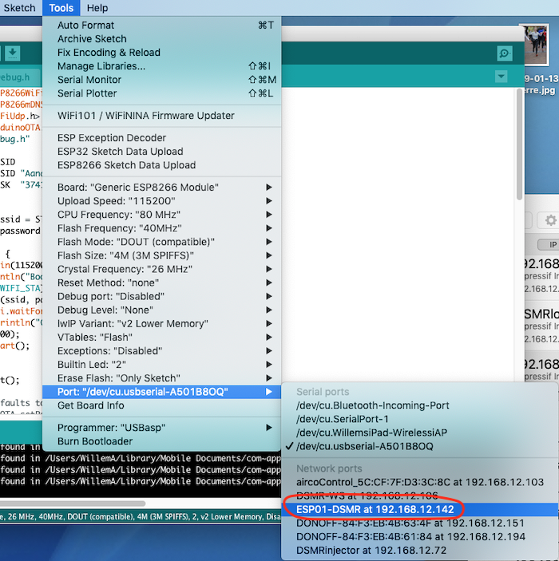

# Eerste keer opstarten

Haal de ESP01 van de programmer/breadboard af en stop hem in de socket van de logger.
Sluit de logger aan op de P1 poort van de "slimme meter". Hij zal gaan booten en maakt 
zijn eigen accesspoint. Dit kun je zien aan het blauwe ledje wat zal gaan knipperen
en daarna constant blijft branden.

Via je computer/mobiel, bekijk de Wifi netwerken, hier zul je een 
`ESP01‑DSMR‑xx‑<IPaddress>` tussen zien staan: connect aan dit AccessPoint (AP).

Zodra je verbonden bent, open de browser en ga naar ip adres wat de naam van het 
accesspoint staat bijv `192.168.5.1`

- Klik op `Configure WiFi`
- Selecteer je eigen WiFi router
- Typ het password
- Klik save

De logger zal rebooten en verbinding maken met jouw WiFi router

Tijdens het opstarten kun je aan de blauwe led zien wat de DSMR-logger aan het doen is:

- 3 x langzaam knipperen – initiële start
- 5 x snel knipperen – verbinding gemaakt met WiFi netwerk

Daarna knippert de blauwe led iedere keer als er een nieuw telegram verwerkt wordt.

Als de led, na de eerste drie keer langzaam knipperen blijft branden, dan kon de 
DSMR-logger geen verbinding met jouw WiFi netwerk maken en start hij weer zijn eigen 
AP op en zal je WiFi procedure opnieuw moeten doen.

Zodra hij geconnecteerd is open een browser en ga naar:
`http://ESP01-DSMR.local/` of `http://<IPadresVanDeLogger>/`

Als je in de browser de tekst `FileNotFound` ziet, dan ben je waarschijnlijk vergeten 
de Data-map te uploaden met de menu-optie `ESP8266 Sketch Data Upload` in de ArduinoIDE
([kijk hier](uploadDataMap_ESP-01.md) hoe dat moet).

Als alles goed is gegaan zie je in de browser de hoofd-pagina van de DSMR-logger met 
daarin de actuele data uit de Slimme Meter.

Je kunt met `telnet ESP01-DSMR.local` of met `telnet <IPadresVanDeLogger>` inloggen 
op je DSMR-logger en volgen waar de DSMR-logger mee bezig is.

Om te bepalen welk IP is uitgegeven aan de ESP door de DHCP server, kun je in je router 
kijken, of met bijv de Fing app of met `nmap`.

Een andere manier om achter het IP-adres van je DSMR-logger te komen is door de  
ArduinoIDE op te starten. 

Onder `Network Ports` staat de `ESP01-DSMR` als optie, met daarachter het IP adres (in dit 
voorbeeld is dat `192.168.12.142`).

