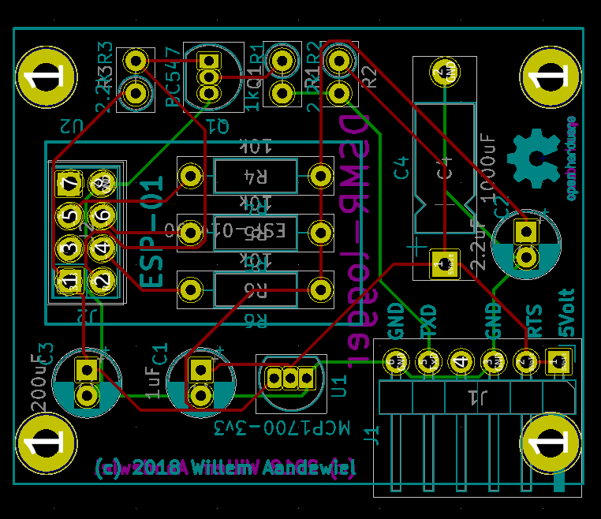

## DSMR-logger Versie 3

Hoe je een DSMRlogger Versie 2 kunt bouwen staat 
<a href="https://github.com/mrWheel/DSMRlogger2HTTP/blob/master/Bouwbeschrijving.pdf" target="_blank">
hier</a>
uitvoerig beschreven.

Versie 3 is gelijk aan Versie 2 met dit verschil dat de transistor en voltage regulator
eenvoudiger zijn te solderen omdat de pad's verder uit elkaar staan.

Versie 3 heeft ook een RJ12 connector waardoor de draadbreuken die met Versie 2
nog wel eens voorkwamen verleden tijd zijn.

Een bouwpakket voor Versie 3 kun je 
<a href="https://opencircuit.nl/Product/13859/Slimme-meter-uitlezer-V3-bouwpakket-met-ESP-01" target="_blank">
hier</a> bestellen.

### Inhoud Opencircuit bouwpakket 

|Aantal|Itemi               |PCB label|
|------|--------------------|---------|
|1x|PCB|-|
|1x|ESP8266 ESP-01S|-|
|1x|BC547|Q1|
|1x|MCP1700-3v3|U1|
|1x|1K Ω weerstand (bruin,zwart,rood)|R1|
|2x|2K2 Ω weerstand (rood,rood,rood)|R2,R3|
|3x|10K Ω weerstand (bruin,zwart,oranje)|R4,R5,R6|
|1x|Elco 1µF|C1| 
|1x|Elco 2.2µF|C2| 
|1x|Elco 1000µF|C3| 
|1x|Socket connector 4x2|J2|
|1x|RJ12 Socket connector|J1|
|1x|RJ12 kabel|-|

### Solderen

Begin met de laagste componenten: 

- Plaats: R4, R5 en R6, plaats deze plat. Weerstanden hebben geen polariteit, de richting 
maakt dus niet uit.
- Plaats R1, R2, R3 rechtop. 
- Plaats Q1 en U1 - de soldeer pads zijn klein en liggen dicht bij elkaar, wees 
zorgvuldig en neem de tijd. 

De Elco's hebben wel polariteit, de negatieve pool is herkenbaar aan de lichtere streep op de 
zijkant. Op de PCB is deze kant aangegeven met een witte helft. Daar moet de negatieve pool 
op worden aangesloten.

- Plaats C1, C2 en C3 met de juiste negatieve pool en de correcte Elco.
- Plaats J2 en J1 

Controleer je werk op slechte soldeerverbindingen (het tin droogt dan *mat* op) en
kortsluiting (tin-bruggen tussen twee pad's).

De ESP01 word uiteindelijk in de socket geplaatst, maar moet eerst nog worden geflashed met 
de `DSMRlogger2HTTP` firmware en de `data`-map moet naar SPIFFS worden ge-upload voordat 
hij kan gaan loggen. Hoe dat moet staat [hier](../uploadFirmware_ESP-01) en 
[hier](../uploadDataMap_ESP-01) beschreven.

 
---

[PCB Versie 2]
 

