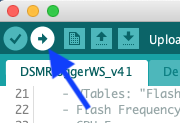
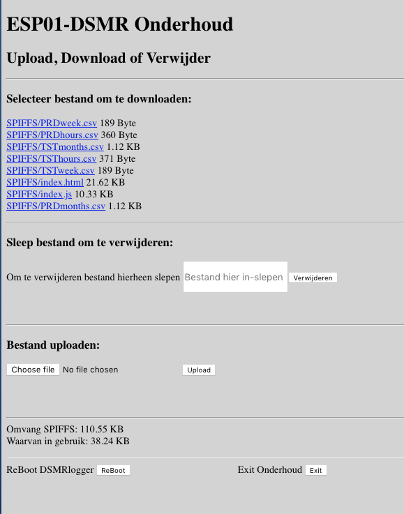

## Firmware naar ESP-01 Flashen
Om de firmware naar de ESP-01 (Black/S) te kunnen flashen moet deze eerst 
voor deze ESP-01 geschikt worden gemaakt.

Dit doen we door vóór de `#define HAS_NO_METER` twee *slashes* (**//**) te zetten.
```
/******************** change this for testing only **********************************/
// #define HAS_NO_METER          // define if No "Slimme Meter" is attached
/******************** don't change enything below this comment **********************/

```

Vervolgens moeten de [`Boards`] settings als volgt worden ingevuld:


|   | Instelling        |Waarde|
|:-:|:------------------|:-----|
|   | Board             | "Generic ESP8266 Module" |
|   | Upload Speed      | "115200" |
|   | CPU Frequency     | "80MHz" |
|   | Flash Frequency   | "40MHz" |
|   | Flash Mode        | "DOUT (compatible)" |
|   | Flash Size        | "1M (256K SPIFFS)" |
|   | Crystal Frequency | "26MHz" |
|   | Reset Method      | "None" |
|   | Debug Port        | "Disabled" |
|   | Debug Level       | "None" |
|   | IwIP Variant      | "v2 Lower Memory" |
|   | VTables           | "Flash" |
|   | Exeptions         | "Disabled" |
|   | Builtin Led       | ESP-01 (Black) "1" <br> ESP-01S "2" |
|   | Erase Flash       | "Only Sketch" <br> First Time "All Flash Contents" |
|   | Port              | Bedraad: "Serial Port" <br> OTA: "Netwerk Port" |


Stop de ESP-01 in de programmer 
([hier](https://willem.aandewiel.nl/index.php/2018/08/27/eenvoudige-programmer-voor-de-esp-01-esp8266/) 
vind je een post over hoe je van een USB to ESP-01
Adapter zelf eenvoudig een programmer kunt maken) en sluit deze aan op je computer.
Vergeet niet de juiste `Port` te selecteren en druk op het *Compile and Upload icoon*.




<br>

---
<center  style="font-size: 70%">[DSMR Onderhoud]</center><br>
<center></center>
